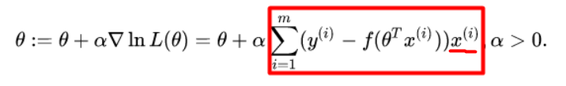

## запуск кода
Для удобства код из файла .ipynb был перенесен в main.py  
Для корреккктнойй работы нужно установить зависимости
```
pip install -r requirements.txt
```
Сам запуск
```
python main.py
```

## Формулы
Рассчет функции предсказываемой вероятности (1, 2)
  
  
Из формулы выше следует, что у весов есть свободный член  
Вопрос №1 - Нужно ли корректировать свободный член весов?  
Рассчет функции потерь  (3)
  
Вопрос №2 - Функция predict по описанию возвращает массив int   
с значениями 0 или 1 (пренадлежность к классу).
По формуле (3) для рассчета потери нужны вероятности, может predict должна
возвращать вероятность
Рассчет весов (4)
  
В формуле красным прямоугольником выделено значение dw, a - это learning_rate
Вопрос №3 по форуле (4) следует что все веса меняются одинаково,   
возможно обведенный x^i должен быть разным для каждого из весов  
в функции loss это выражается заменой обведенного x^i на X_batch[i][j]  
но x имеет меньшую длину чем вектор весов, возможно пересчитывать свободный член не нужно?

