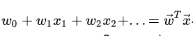
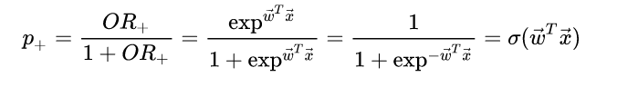
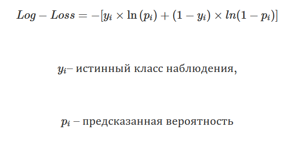
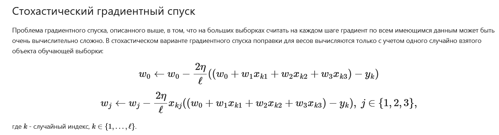
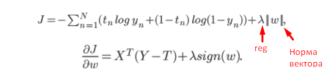

## запуск кода
Для удобства код из файла .ipynb был перенесен в main.py  
Для корреккктнойй работы нужно установить зависимости
```
pip install -r requirements.txt
```
Сам запуск
```
python main.py
```

## Формулы
Рассчет функции предсказываемой вероятности (1, 2)  
   
 
Рассчет функции потерь  (3)  

Рассчет весов при помощи стохастического градиентного спуска(4)
    
Регуляризация (сверху для функции потерь, снизу для коррекции весов)
  
